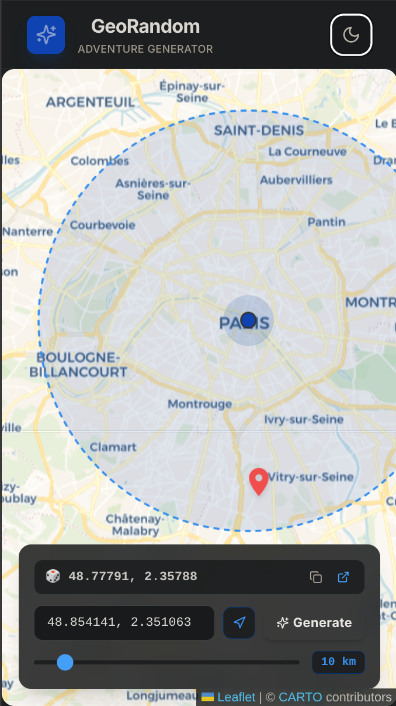
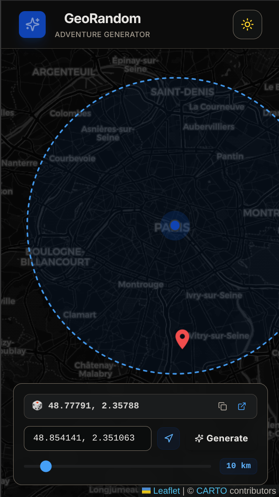

# GeoRandom Adventure Generator

## Introduction

**GeoRandom** (formerly *Random Location*) is a modern, responsive web application designed to help you discover random geographic locations within a specified radius from any custom center point. 

The application has been completely redesigned with a premium **glassmorphic floating dashboard** layout, on-demand geolocation, interactive map clicks, and real-time geofence boundaries.

Visit the live application at https://futurk.github.io/randomlocation/ to see it in action.

---

## 🎨 App Screenshots




---

## ⚡ Tech Stack

- **Vite:** Next-generation frontend tooling providing blazing-fast HMR and building.
- **React (v18):** For building the component-based, stateful user interface.
- **TypeScript:** For absolute type safety and a robust development experience.
- **Tailwind CSS:** For clean, modern glassmorphic layouts and responsive design.
- **React Leaflet (v4) & Leaflet (v1.9):** High-performance interactive map engine.
- **Lucide React:** For clean, modern iconography.
- **Vitest & JSDOM:** For rapid, reliable unit testing.
- **gh-pages:** Automated pipeline publishing directly to GitHub Pages.

---

## 🌟 Premium Features

- **📍 Tap-to-Center Map Interaction**: Set your target search area instantly by clicking or tapping anywhere on the map—no manual typing required.
- **🛰️ On-Demand Geolocation**: Respects your privacy. Your browser location is only fetched when you explicitly click the **"Locate Me"** button.
- **⭕ Dynamic Search Boundary (Geofence)**: Visually renders a semi-transparent, styled radius boundary on the map, illustrating the exact search zone.
- **🎲 Manual/Explicit Generation**: Random locations are only calculated when you explicitly hit the **"Generate Random Location"** button.
- **🎛️ Dual-Device Layouts**:
  - **Desktop**: A sleek, translucent glassmorphic control card floating on top of the map.
  - **Mobile**: A modern bottom-drawer sheet accessible near thumbs, optimized for one-handed mobile use.
- **📋 Copy & External Navigation**: Copy your generated coordinates instantly to your clipboard with custom confirmation feedback, or click to open them directly in **Google Maps**.
- **☀️ Light & Dark Themes**: Fully integrated system supporting dark mode and light mode color spaces.

---

## 🛠️ Installation & Setup

### 1. Clone the repository
```bash
git clone https://github.com/pappater/randomlocation.git
cd randomlocation
```

### 2. Install dependencies
```bash
npm install
```

### 3. Run the application locally
To launch the Vite development server:
```bash
npm run dev
```
Open your browser and navigate to `http://localhost:5173/randomlocation/`.

---

## 📈 Scripts

Inside the project, you can run the following commands:

- **`npm run dev`**: Starts the local development server with Vite.
- **`npm run build`**: Compiles TypeScript definitions and builds production assets inside the `/dist` directory.
- **`npm run test`**: Runs the unit test suite using **Vitest**.
- **`npm run deploy`**: Bundles the application for production and publishes it directly to your GitHub Pages branch.

---

## 🚀 Deployment with GitHub Pages

Deployment is automated via `gh-pages` and Vite:

1. To compile the latest code and deploy to your GitHub Pages URL, execute:
   ```bash
   npm run deploy
   ```
2. The package will compile TypeScript, build assets to the `/dist` folder, and publish that directory to your repository's `gh-pages` branch.

---

## 📝 Changelog

- **[Version 2.0.0]**
  - Deprecated and removed legacy `create-react-app` (`react-scripts`).
  - Migrated the entire build and development pipeline to **Vite** and **Vitest**.
  - Re-implemented the interface from scratch, introducing floating glassmorphic dashboards, absolute bottom-sheets for mobile, explicit click-to-generate mechanics, interactive map clicks, geofence boundary drawings, and custom vector pins.
- **[Version 1.1.0]** Added custom radius input and improved map responsiveness.
- **[Version 1.0.0]** Initial release built using create-react-app.

---

## 💻 Environment & Compatibility

- **Node.js**: Recommended Version `v20.x.x` or later.
- **TypeScript**: Compatibility set to target `ESNext` with standard Vite modular resolution patterns.
