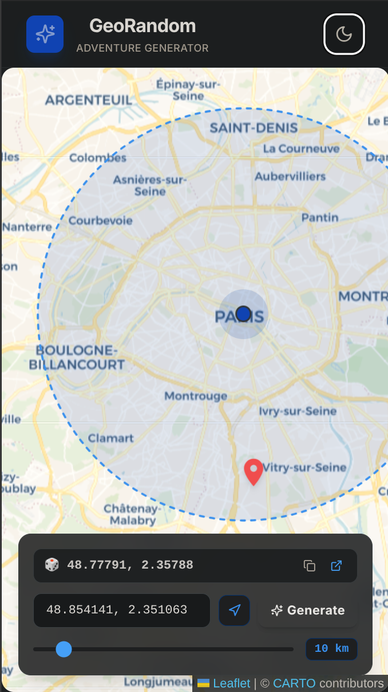
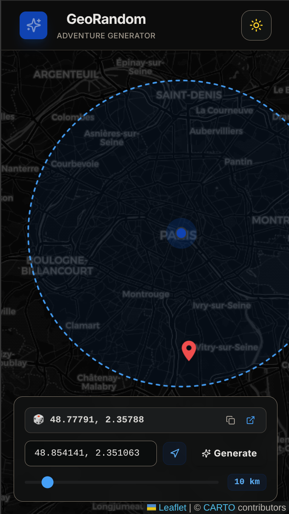

# GeoRandom Adventure & Route Generator

## Introduction

**GeoRandom** (formerly *Random Location*) is a modern, responsive web application designed to help you discover random geographic destinations and generate multi-waypoint adventure routes from any custom origin.

The application features a premium **glassmorphic dashboard**, expandable mobile bottom drawers, on-demand geolocation, interactive map clicks, dual geofence boundaries, and direct integrations with **Google Maps** and **Komoot Tour Planner**.

Visit the live application at [https://futurk.github.io/randomlocation/](https://futurk.github.io/randomlocation/) to see it in action.

---

## 🎨 App Screenshots




---

## ⚡ Tech Stack

- **Vite:** Next-generation frontend tooling providing blazing-fast HMR and bundling.
- **React (v18):** For building the component-based, stateful user interface.
- **TypeScript:** For absolute type safety and a robust development experience.
- **Tailwind CSS:** For clean, modern glassmorphic layouts and responsive design.
- **Vite PWA Plugin:** Enables offline caching, auto-updating, and full mobile installability (PWA) via modern Workbox Service Workers.
- **React Leaflet (v4) & Leaflet (v1.9):** High-performance interactive map engine.
- **Lucide React:** For clean, modern iconography.
- **Vitest & JSDOM:** For rapid, reliable unit testing.
- **gh-pages:** Automated pipeline publishing directly to GitHub Pages.

---

## 🌟 Core Modes & Features

### 📍 Mode 1: Single Location Generator
- **Dual Annulus Boundaries**: Specify both **Min Radius** (Amber inner ring) and **Max Radius** (Blue outer ring) from $0\text{km}$ up to $500\text{km}$.
- **Uniform Sampling**: Calculates points uniformly distributed by area within the ring between your minimum and maximum distance constraints.

### 🗺️ Mode 2: Random Route Planner
- **Multi-Waypoint Paths**: Select between **1, 2, 3, or 4 waypoints**.
- **Max-Entropy Geometry**: Generates natural, organic shapes (curves, zig-zags, L-shapes) with wide $280^\circ$ turn freedom and variable segment ratios.
- **Round-Trip vs. One-Way**:
  - **Round Trip (Loop)**: Constructs a closed circuit starting at Center, looping through Waypoints $1 \dots N$, and returning back to Center.
  - **One Way**: Constructs an open polyline ending at Waypoint $N$.
- **Total Route Distance**: Sets minimum and maximum limits ($0\text{km} - 500\text{km}$) for the **TOTAL approximate route length**.

---

## 🎛️ User Experience Highlights

- **🎚️ Dual-Thumb Range Sliders**: Adjust Min and Max distance boundaries on a single unified slider track with 10 km step increments and direct editable typing boxes.
- **📍 Tap-to-Center Map Interaction**: Set your target origin instantly by clicking or tapping anywhere on the map—or typing exact coordinates.
- **🛰️ Embedded GPS Target Button**: Native map `LocateFixed` target icon embedded directly inside the coordinate text field for high-accuracy browser location fetching.
- **📱 Expandable Mobile Drawer**: An ultra-clean, collapsed mobile dock keeps 95% of the viewport focused on the map, with an expandable bottom sheet drawer for full configuration.
- **📏 Distance Calculation Engine**: Computes exact Haversine air distances for single points and total route paths, formatted nicely in meters or kilometers.
- **📋 Copy Coordinates**: Copy coordinates to clipboard instantly with visual feedback in dashboard result views and directly inside map marker popup dialogs.
- **🚗 Third-Party Integrations**: Open single points or full multi-waypoint routes directly in **Google Maps** or **Komoot Tour Planner**.
- **📲 Mobile Installable (PWA)**: Install GeoRandom directly to your home screen on iOS and Android as a full-screen native PWA.
- **☀️ System Theme Support**: Dynamically detects dark/light system preference on load with session-level manual overrides.

---

## 📲 Progressive Web App (PWA) Installation

You can install **GeoRandom** on your mobile devices and desktop to run it as a standalone, fullscreen native application:

### 🤖 On Android (Chrome / Bromite / Brave)
1. Navigate to [https://futurk.github.io/randomlocation/](https://futurk.github.io/randomlocation/) in your browser.
2. Tap the **"Add to Home Screen"** banner that appears at the bottom, or click the browser menu (three vertical dots) and select **"Install App"**.

### 🍏 On iOS (Safari)
1. Navigate to [https://futurk.github.io/randomlocation/](https://futurk.github.io/randomlocation/) in Safari.
2. Tap the **Share** button (box with an upward arrow 📤) in the bottom toolbar.
3. Scroll down and tap **"Add to Home Screen"** (plus icon ➕).

### 💻 On Desktop (Chrome / Edge / Opera)
1. Navigate to [https://futurk.github.io/randomlocation/](https://futurk.github.io/randomlocation/).
2. Click the **Install** monitor icon in the right-hand side of your browser's address bar.

---

## 🛠️ Installation & Setup (Local Development)

### 1. Clone the repository
```bash
git clone https://github.com/futurk/randomlocation.git
cd randomlocation
```

### 2. Install dependencies
```bash
npm install
```

### 3. Run the application locally
To launch the Vite development server:
```bash
npm run dev
```
Open your browser and navigate to `http://localhost:5173/randomlocation/`.

---

## 📈 Scripts

Inside the project, you can run the following commands:

- **`npm run dev`**: Starts the local development server with Vite.
- **`npm run build`**: Compiles TypeScript definitions, builds production assets, and generates PWA Service Workers inside the `/dist` directory.
- **`npm run test`**: Runs the unit test suite using **Vitest**.
- **`npm run deploy`**: Bundles the application for production and publishes it directly to your GitHub Pages branch.

---

## 🚀 Deployment with GitHub Pages

Deployment is automated via `gh-pages` and Vite:

1. To compile the latest code and deploy to your GitHub Pages URL, execute:
   ```bash
   npm run deploy
   ```
2. The package will compile TypeScript, build assets to the `/dist` folder, and publish that directory to your repository's `gh-pages` branch.

---

## 📝 Changelog

- **[Version 2.0.0]**
  - Introduced **Random Route Planner Mode** with multi-waypoint polyline pathing and round-trip support.
  - Re-engineered sliders with custom **Dual-Thumb Range Sliders** supporting 10km step steps and direct number typing.
  - Expanded search boundaries from **0 km up to 500 km**.
  - Added Haversine distance calculations and inline copy buttons inside map popups.
  - Added **Komoot Tour Planner** and **Google Maps** multi-waypoint integration.
  - Redesigned mobile UX with an expandable bottom drawer and embedded GPS target button.
  - Migrated build pipeline from Create React App to **Vite**, **Vitest**, and **Vite PWA**.
- **[Version 1.1.0]** Added custom radius input and improved map responsiveness.
- **[Version 1.0.0]** Initial release built using create-react-app.

---

## 💻 Environment & Compatibility

- **Node.js**: Recommended Version `v20.x.x` or later.
- **TypeScript**: Compatibility set to target `ESNext` with standard Vite modular resolution patterns.
